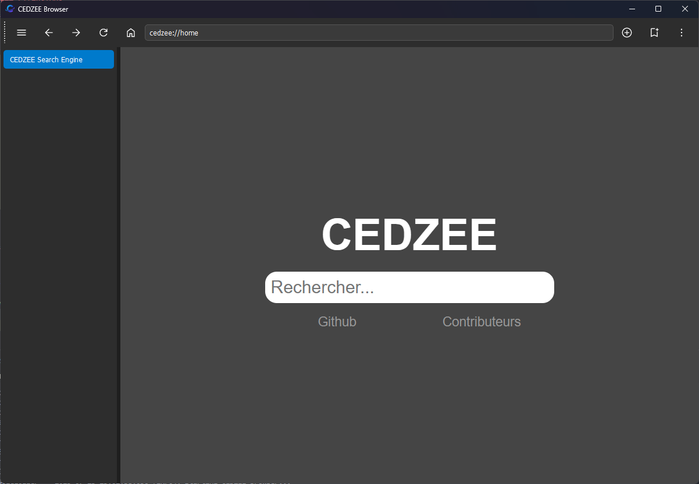

# CEDZEE Browser

## Powerful browser

>
> 
>

---

## Utilization and installation

```sh
git clone https://github.com/cedzeedev/cedzeebrowser.git
cd cedzeebrowser
pip install -r requirements.txt
python ./main.py
```

# For developers 

If you wish to contribute to the project, I recommend focusing on the features outlined in the [TODO.md](TODO.md).

## Organization

**Minimal configuration**:

```txt
./
├── ...
├── main.py
├── src
│   └── *.py
├── offline
│   ├── ...
│   └── index.html
├───resources
│   |──...
│   └──icons
│       └── *.png
├── theme
│   ├── ...
│   └── theme.css
└── web
    └── *.html
```

## Theme and color scheme

- `theme/theme.css`: Style sheet for the search engine theme

---

## Contributing

The cedzee browser source code is located in the Git repository at [github.com/cedzeedev/cedzeebrowser](https://github.com/cedzeedev/cedzeebrowser/).
Contributions are most welcome by forking the repository and sending a pull request.

> [!NOTE]
>
> Please respect our [organization](#organization)
>

## Credit

**Contributors :**

[](https://cedzee-browser-contributors.vercel.app/)

>
> Fait avec le ❤️ par la communauté !
>
